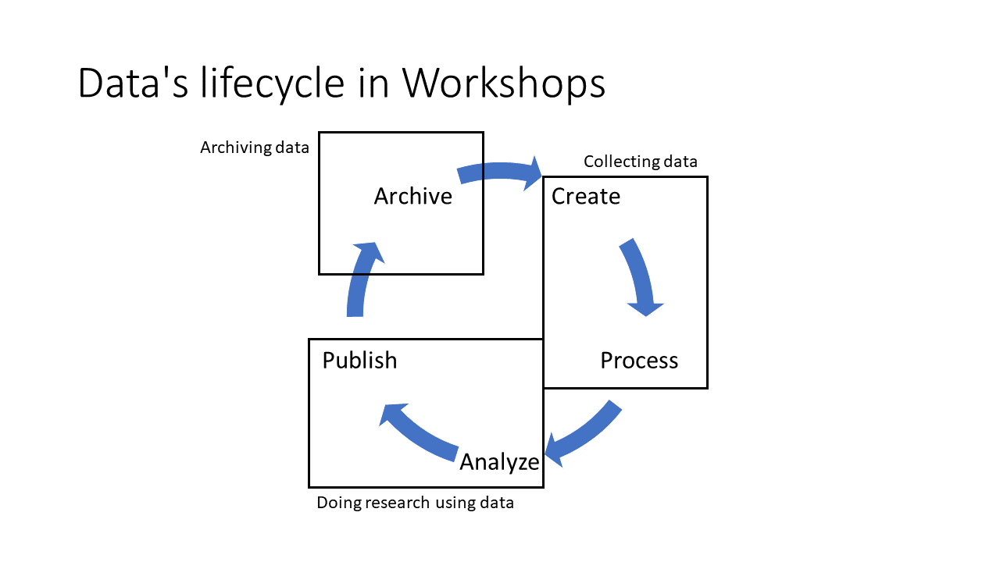

# Data Management by Design - Workshops

Here you can find the materials related to the three workshops of the
'Data Management by Design' activity.

The goal of the workshops was to identify important requirements to the
implementation of **research data infrastructure** in a university setting from
the various stakeholders along with their primary motives.

Each workshop had a fokus on part of the "research data lifecycle" as
illustrated below.

## Workshop 1

The theme for the [first workshop](ws1) was **Archiving data**. 

As can be seen from the [presentation from the first
workshop](ws1/ws1-slides.pdf), a rather large subset of the ArchiMate
modelling language was introduced. During the workshop it became
obvious that this subset was too complex for the task. The much
simpler subset of the ArchiMate language illustrated below was
adopted.

This simlper subset was used to model the motivations and goals of
stakeholders having requirements to the handling of research data at
universities during all the workshops.

## Workshop 2

The theme for the [second workshop](ws2) was **Collecting data**. 

The presentation from the second workshop is available as a
[PDF](ws2/ws2-slides.pdf).

## Workshop 3

The theme for the [third workshop](ws3) was the somewhat broad **Doing reasearch with data**, to encompass the breadth of processing data in a research. 

The presentation from the second workshop is available as a
[PDF](ws3/ws3-slides.pdf).

# Outcome

The outcome from each workshop was the collection of stakeholders,
drivers, goals and requirements indentified as having some significant
role in relation to research data management during the phas that was
the theme of the workshop. The raw outcome of each workshop can be
found in its subfolder.

# The common ground

The outcomes from the workshops where later merged to become the **initial findengs views** that would be the startingpoint for the [common ground model](../common].

# Licence 

All material made by the activity [Data Management by Design](https://github.com/Data-Management-by-Design/DMbD) is made available under a Creative Commons licence.

CC-BY 4.0 Danish DM Forum 'Data Management by Design' activity

 Data Management by Design by <a xmlns:cc="http://creativecommons.org/ns#" href="https://github.com/Data-Management-by-Design/DMbD" property="cc:attributionName" rel="cc:attributionURL">Data Management by Design</a> is licensed under a <a rel="license" href="http://creativecommons.org/licenses/by/4.0/">Creative Commons Attribution 4.0 International License</a>.

Material used or referenced in this work may be under diffent licences.

