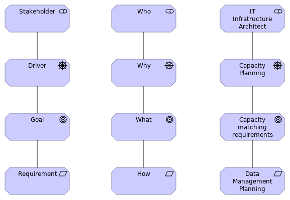

# Data Management by Design - Workshop 2 - Collecting data

Here you can find the materials related to the second workshop of the
'Data Management by Design' activity.

The goal of the workshop was to identify important requirements to the
infrastructure supporting the collection of research data in a
university setting. 

The presenentation from the workshop is available as a [PDF](ws2-slides.pdf). 

## Method

A subset of the ArchiMate language is used to model the motivations
and goals of stakeholders having requirements to the handling of
research data at universities.

Each workshop participant prepared examples of drivers, requirements
and goals for a number of stakeholders in their institution. The
modelling subset was preserved but this time the modeling was done in
the form of a table in a spreadsheet. The lesson from the first
workshop was that creating an ArchiMate model directly at the workshop
was not efficient.

At the workshop the participants split into three groups that expanded
on gaps in the prepaired modelling scenarios.

## Results

The combined tables from the workshop preparation and the workshop can
be found in the [raw-data directory](raw-data). There is a sheet for
each group.

The combined results from all workshops have been collected into a
single model in the [common directory](../common).

## Presentation

The presenentation from the workshop is available as a [PDF](ws2-slides.pdf). 

# Licence 

All material made by the activity [Data Management by Design](https://github.com/Data-Management-by-Design/DMbD) is made available under a Creative Commons licence.

CC-BY 4.0 Danish DM Forum 'Data Management by Design' activity

 Data Management by Design by <a xmlns:cc="http://creativecommons.org/ns#" href="https://github.com/Data-Management-by-Design/DMbD" property="cc:attributionName" rel="cc:attributionURL">Data Management by Design</a> is licensed under a <a rel="license" href="http://creativecommons.org/licenses/by/4.0/">Creative Commons Attribution 4.0 International License</a>.

Material used or referenced in this work may be under diffent licences.

