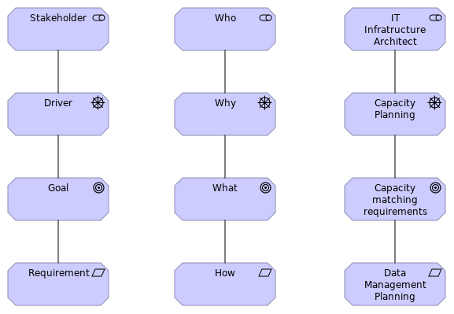

# Data Management by Design - Workshop 1 - Archiving

Here you can find the materials related to the first workshop of the
'Data Management by Design' activity.

The goal of the workshop was to identify important requirements to the
implementation of a research data archive in a university setting from
the various stakeholders along with their primary motives.

## Method

A subset of the ArchiMate language is used to model the motivations
and goals of stakeholders having requirements to the handling of
research data at universities.

## Results

Modelling is still ongoing. This repository is used to coordinate the
effort in an open process. We invite anybody, with insight, to
contribute to the result.

The current combined model is in the file [WS1result.archimate](WS1result.archimate) which must be opened using [Archi](https://www.archimatetool.com/).

Aternatively you can [view it directly in your browser](https://cdn.rawgit.com/Data-Management-by-Design/DMbD/7998b0bf/ws1/html/WS1result/index.html).

Printable report style versions versions are avilable in
[PDF](exported/WS1presentation.pdf) or
[HTML](https://cdn.rawgit.com/Data-Management-by-Design/DMbD/7998b0bf/ws1/exported/WS1result.html) format.

## Presentation

The modelling examples used in the presentation at the workshop are in
[WS1presentation.archimate](WS1presentation.archimate) which must be
opened using [Archi](https://www.archimatetool.com/).

Aternatively you can [view it directly in your browser](https://cdn.rawgit.com/Data-Management-by-Design/DMbD/7998b0bf/ws1/html/WS1presentation/index.html).

Printable report style versions are avilable in
[PDF](exported/WS1presentation.pdf) or
[HTML](https://cdn.rawgit.com/Data-Management-by-Design/DMbD/7998b0bf/ws1/exported/WS1presentation.html) format.

# Attribution

This work is performed by a consortium of Danish Universities:

* [Aalborg University](https://www.en.aau.dk/)
* [The University of Southern Denmark](https://www.sdu.dk/en/)
* [Technical University of Denmark](https://www.dtu.dk/english)
* [Copenhagen Business School](https://www.cbs.dk/en)
* [University of Copenhagen](https://www.ku.dk/english/)

The activity is funded by
[Danish e-Infrastructure Cooperation (DeiC)](https://www.deic.dk/en ) and
[Denmarks Electronic Research Library (DEFF)](https://www.deff.dk/english/)

# Licence 

All material made by the activity 'Data Management by Design' is made available under a Creative Commons licence.

CC-BY 4.0 Danish DM Forum 'Data Management by Design' activity

 Data Management by Design by <a xmlns:cc="http://creativecommons.org/ns#" href="https://github.com/Data-Management-by-Design/DMbD" property="cc:attributionName" rel="cc:attributionURL">Data Management by Design</a> is licensed under a <a rel="license" href="http://creativecommons.org/licenses/by/4.0/">Creative Commons Attribution 4.0 International License</a>.

Material used or referenced in this work may be under diffent licences.

